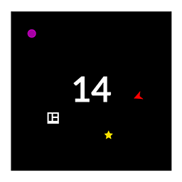
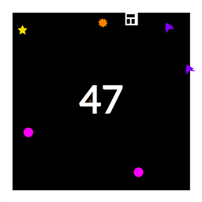
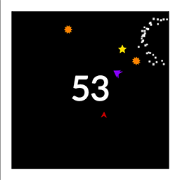

# Boxed In

  

A casual game made with [Construct 3](https://construct.net/) for [Ludum Dare 54](https://ldjam.com/events/ludum-dare/54). The theme was "Limited Space".

## Screenshots

  

  

  

## Links
- [Ludum Dare submission](https://ldjam.com/events/ludum-dare/54/boxed-in)
- [Play on itch.io](https://raassh.itch.io/boxed-in)
- [Leaderboard repository](https://github.com/raassh-23/ludum-dare-54-leaderboard)
